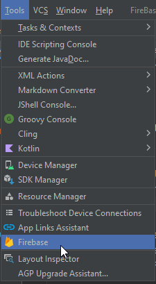
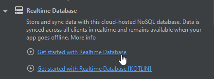
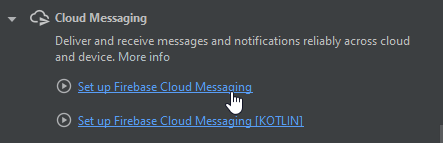
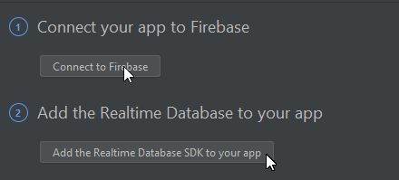
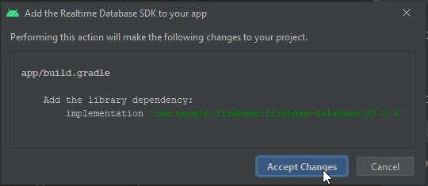
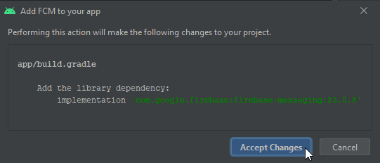

<center>

# `Notificaciones Android mediante Firebase`
</center>

En el siguiente repositorio se encontrarán los fragmentos de código necesarios para poder utilizar notificaciones enviadas desde Firebase en dispositivos que utilicen Android, debido a que se utilizaron dos métodos distintos hay mas de una manera de generar lo mismo, como por ejemplo la creación del canal necesario en Android. 
Además también se verá como conectar la aplicación con la base de datos correspondiente. 

<center>

# `Firebase`
</center>
Es una base de datos en la nube que nos otorga Google y permite un soporte multiplataforma facil de gestionar.

## `Conexión con Android`
Hay dos maneras de conectar la base de datos, mediante código y utilizando las herramientas de Android Studio, en este caso se explicará la segunda opción.

* Ir a las herramientas de Android y seleccionar la opción "Firebase".
<center>


</center>

* Seleccionar las opciones `Realtime Database` y `Cloud Messasing`, conectar en ambos casos la BD e implementar las librerias correspondientes. Esto se puede hacer de forma manual pero de esta manera uno se asegura instalar la última librería disponible.
  
<center>




En ambos casos seleccionar ambas opciones



Implementar las librerias (esto se hace en la segunda opción)




</center>

Listo, el programa ya se encuentra conectado con la BD. 

## `Envio de notificaciones`
Desde Firebase podemos enviar notificaciones a los dispositivos que tengan la aplicación, esto lo hacemos desde nuestra base de datos, con la opción "Messasing".

Dentro de la misma se crea una nueva campaña en la cual se setearan las características de la notificación.

### Configuración de la notificación
La notificación se divide en cinco items:

1. Notificación: Contiene los datos que el usuario visualizará en la misma (título, imagen y texto).
2. Orientación: Permite seleccionar a que aplicación enviaremos la notificación, en caso de tener mas de una asociada a la misma BD o podemos elegir un grupo de usuarios específicos mediante un tema.
3. Programación: Se setea cuando uno quiere mandar la notificación, ya que puede ser instantánea o programada para mas adelante. 
4. Eventos de conversión.
5. Opciones Adicionales: Permite enviar datos dentro de la aplicación con un objeto clave/valor y seleccionar el vencimiento de la notificación. 

Una vez configurado esto presionarmos en "Revisar" y luego enviamos la notificación.

<center>

# `Android Studio`
</center>

Primero se debe crear una clase que extienda de `FirebaseMessagingService` y dentro de esta se crearan los métodos para recuperar la información enviada desde la notificación. 

### Variables utilizadas:

```java
//Definición de las variables
    private static final String CHANNEL_ID = "canal";
    private PendingIntent pendingIntent;
    String ejem1 = "";
    String ejem2 = "";
```
### Token dentro de la BD

Cada vez que un dispositivo descarga la aplicación, esta genera un token único, para recuperar este Token y guardarlo se debe poner lo siguiente:

```java
/**
* Genera y muestra el nuevo token del dispositivo, este se genera al instalar la aplicación
*
* @param token
*/
@Override
public void onNewToken(@NonNull String token) {
    super.onNewToken(token);
    //Mostramos en el log el token del dispositivo, este se genera cuando se instala la aplicación
    Log.e("token,", "Mi token es: " + token);
    SaveToken(token);
}

/**
* Escribimos el token dentro de firebase para tener un resgistro de los mismos
*
* @param token
*/
private void SaveToken(String token) {
    DatabaseReference ref = FirebaseDatabase.getInstance().getReference().child("Token");
    ref.child("Virtual").setValue(token);
}
```

Con esto se podrá reconocer a los usuarios dentro de la BD en caso de que queramos enviarle un mensaje a uno en particular o conocer la actividad del mismo. 

### Utilizar los datos enviados en la notificación
La notificación tiene distintas características, estas pueden ser capturadas por la aplicación para poder trabajar con la información que contienen. A continuación se puede observar como se captura el título, el texto y las variables enviadas por una notificación:

```java
/**
* Recibe los mensajes enviados en las notificaciones dentro del LOG
*
* @param remoteMessage
*/
@RequiresApi(api = Build.VERSION_CODES.O)
@Override
public void onMessageReceived(@NonNull RemoteMessage remoteMessage) {
    super.onMessageReceived(remoteMessage);

    //Saber desde que emisor llega el push
    Log.e("TAG", "Mensaje recibido de " + remoteMessage.getFrom());

    /*
    * Obtener título y cuerpo de una notificación, utilizando GetNotificación
    * (método para trabajar sobre la misma, no sobre la información que trae)
    */
    if (remoteMessage.getNotification() != null) {
        Log.e("tag", "El título es :" + remoteMessage.getNotification().getTitle());
        Log.e("tag", "El mensaje es :" + remoteMessage.getNotification().getBody());

    }


}
```
Y para obtener los datos enviados mediante key/value desde firebase debemos realizar un ``IF`` en el `main`:

```java
// Recupera los datos enviados por key/value desde firebase
    if (getIntent().getExtras() != null) {
        //El parametro enviado en el getString debe ser la key puesta en firebase
        String value = getIntent().getExtras().getString("ejem1");
        Log.e("TAG", "Capturado en segundo plano: " + value);
        txt.setText(value);
        value = getIntent().getExtras().getString("ejem2");
        Log.e("TAG", "Capturado en segundo plano: " + value);
    }
```

Android desarrollo los canales de mensajería a partir de Android Oreo (versión 8.0), es por esto que se necesita construir un canal para poder utilizar las notificaciones, esto se hace de la siguiente manera:

```java
//Construye el canal
@RequiresApi(api = Build.VERSION_CODES.O)
private void showNotification() {
    NotificationChannel channel = new NotificationChannel(CHANNEL_ID,
            "NEW", NotificationManager.IMPORTANCE_DEFAULT);
    NotificationManager manager = (NotificationManager) getSystemService(NOTIFICATION_SERVICE);
    manager.createNotificationChannel(channel);
    setPendingIntent(MainActivity2.class);
}
```


### Envio de notificaciones desde un dispositivo
Se pueden enviar notificaciones al resto de los usuarios desde un dispositivo. En caso de no estar seguros la versión de los dispositivos que utilizaran la aplicación se puede generar una validación previa y luego la construcción de los canales correspondientes:

```java
if (Build.VERSION.SDK_INT >= Build.VERSION_CODES.O) {
        showNotification();
    } else {
        showNewNotification();
    };
```

Y los métodos serían: 

```java
//Contruye el canal
@RequiresApi(api = Build.VERSION_CODES.O)
private void showNotification() {
    NotificationChannel channel = new NotificationChannel(CHANNEL_ID,
        "NEW", NotificationManager.IMPORTANCE_DEFAULT);
    NotificationManager manager = (NotificationManager) getSystemService(NOTIFICATION_SERVICE);
    manager.createNotificationChannel(channel);
    showNewNotification();
}

//Envia la notificación y la muestra
private void showNewNotification() {
    setPendingIntent(MainActivity.class);
    NotificationCompat.Builder builder = new NotificationCompat.Builder(getApplicationContext(),
        CHANNEL_ID)
        .setAutoCancel(true)
        .setSmallIcon(R.drawable.logo_wienerlab)
        .setContentTitle("New Notification")
        .setContentText("New MainActivity Notification")
        .setPriority(NotificationCompat.PRIORITY_DEFAULT)
        .setContentIntent(pendingIntent)
        .setStyle(new NotificationCompat.BigTextStyle()
                .bigText("Por favor controlar las pedidos realizados en el día de ayer."));
    NotificationManagerCompat managerCompat = NotificationManagerCompat.from(getApplicationContext());
    managerCompat.notify(1, builder.build());
```
### Escucha constante a la base de datos
Se puede configurar una escucha constante para mantener actualizados los datos en tiempo real, en caso de no querer enviarlos por una notificación.

```java
TextView textView = findViewById(R.id.txt);
//Crear entidad para la BD
FirebaseDatabase database = FirebaseDatabase.getInstance();
//Persistencia de la BD sin conexión
database.getInstance().setPersistenceEnabled(true);
//Creamos una referencia a la BD y le seteamos un valor nuevo
DatabaseReference ejemplo = database.getReference("Tabla");
ejemplo.setValue("Registro");

// Lectura desde la BD en tiempo real, utilizamos la variable creada anteriorimente
ejemplo.addValueEventListener(new ValueEventListener() {
    @Override
    public void onDataChange(DataSnapshot dataSnapshot) {
        String value = dataSnapshot.getValue(String.class);
        textView.setText(value);
    }

    @Override
    public void onCancelled(DatabaseError error) {
        String value = error.getMessage();
        textView.setText(value);
    }
});
```

Material utilizado para el desarrollo:

* [Documentación FireBase](https://firebase.google.com/docs/database/android/start?hl=es-419 "Documentación Firebase")
* [Video Mouredev](https://www.youtube.com/watch?v=t5yyc1XfQrs "Youtube - MoureDev")
* [Paradigma Digital](https://www.paradigmadigital.com/dev/crear-base-datos-firebase/ "Firebase en Paradigma Digital")
